Admin front-end

Admin front-end has 2 main features:
1.	Student search
2.	Analytics

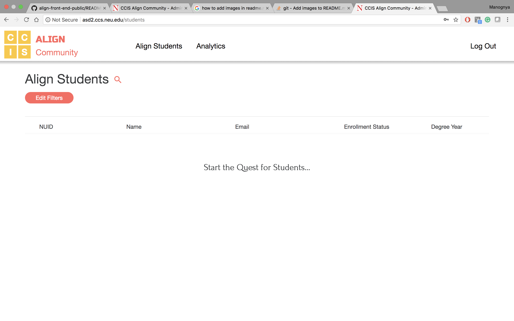

Student Search

"	Admin can search for students based on campus, Enrollment status, co-op company etc. Required filters are selected and applied.

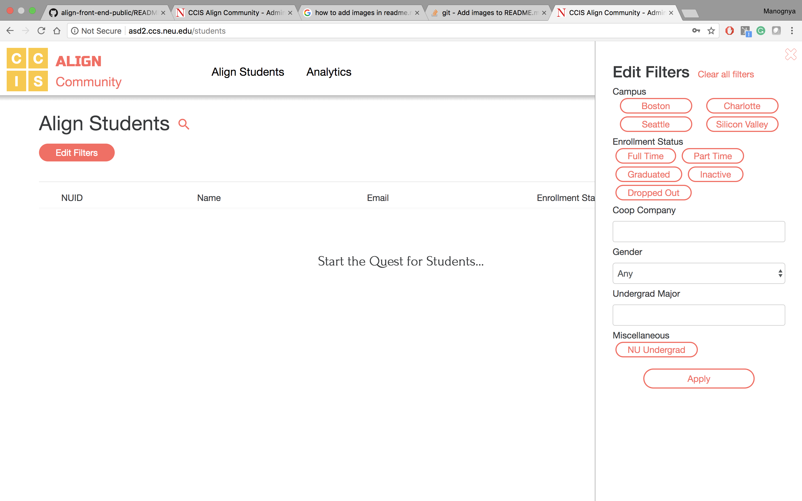

"	List of students is displayed based on the selection criteria.

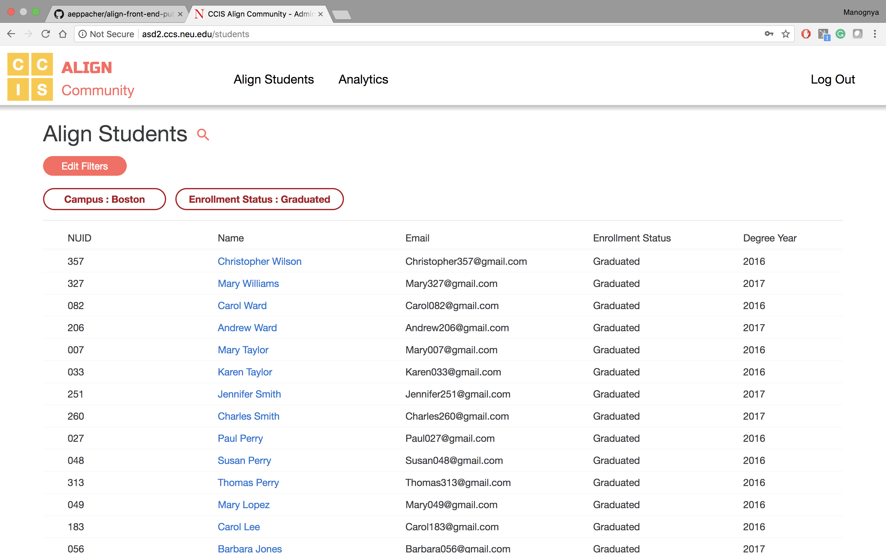

"	On selecting a student, his/her profile is shown

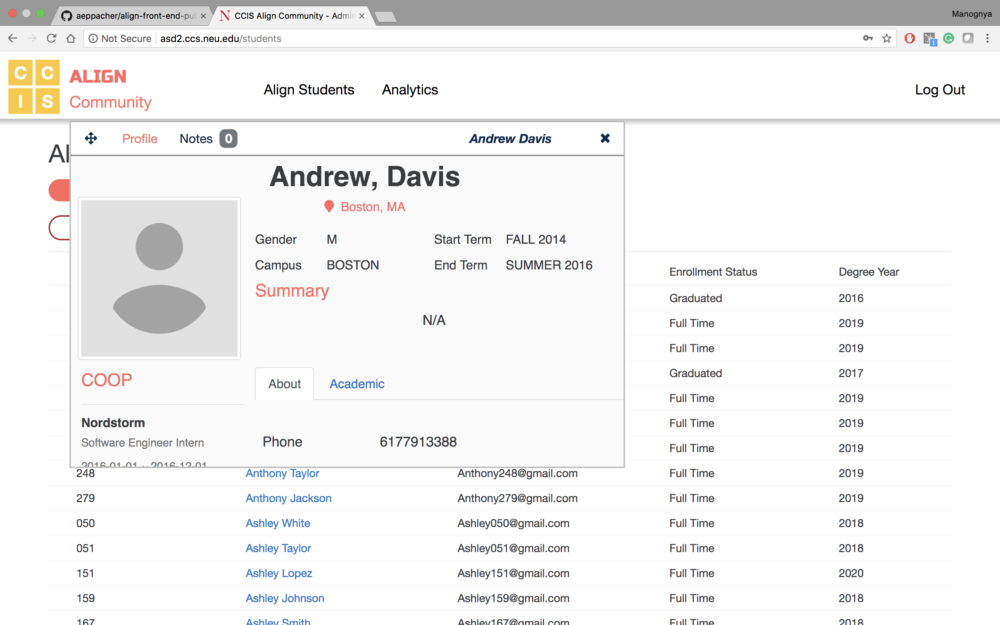

"	Multiple profiles can be viewed at the same time.

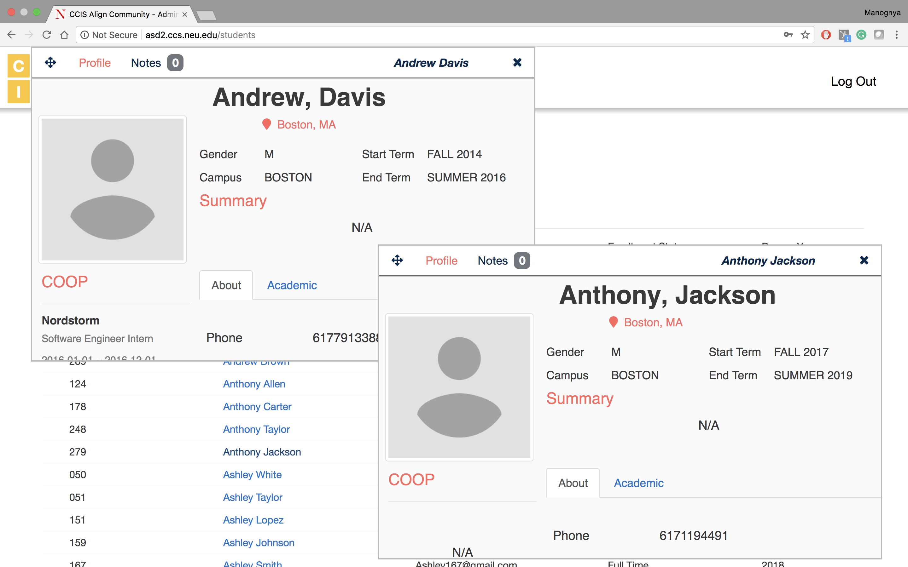

"	The students profile displays information about the student and the courses taken along with the grade scored.

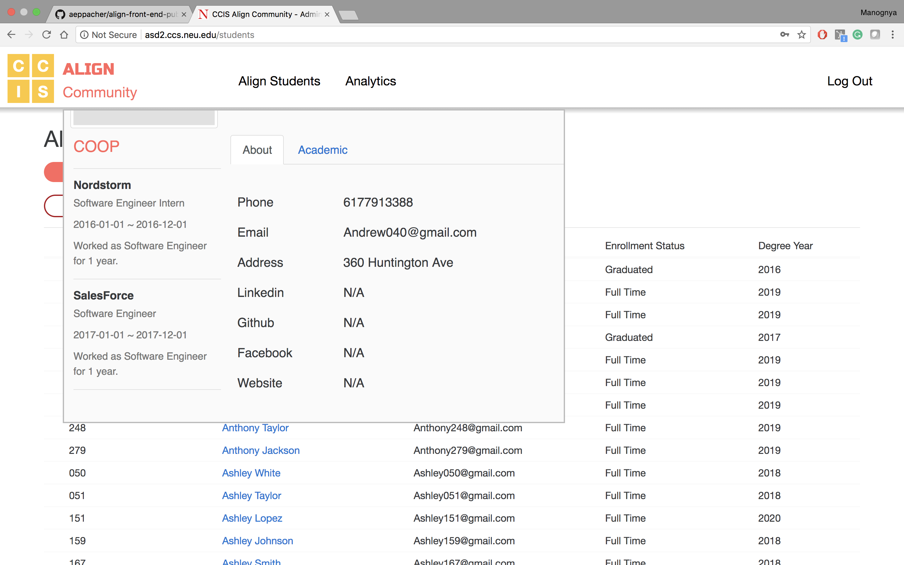

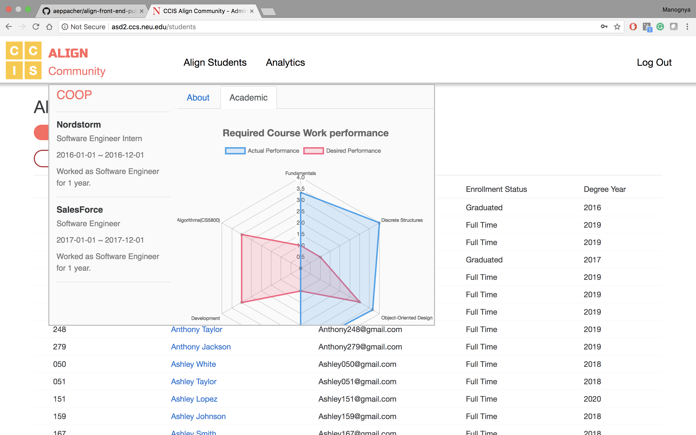

"	The students profile has a section where admin can add, edit or delete a note.

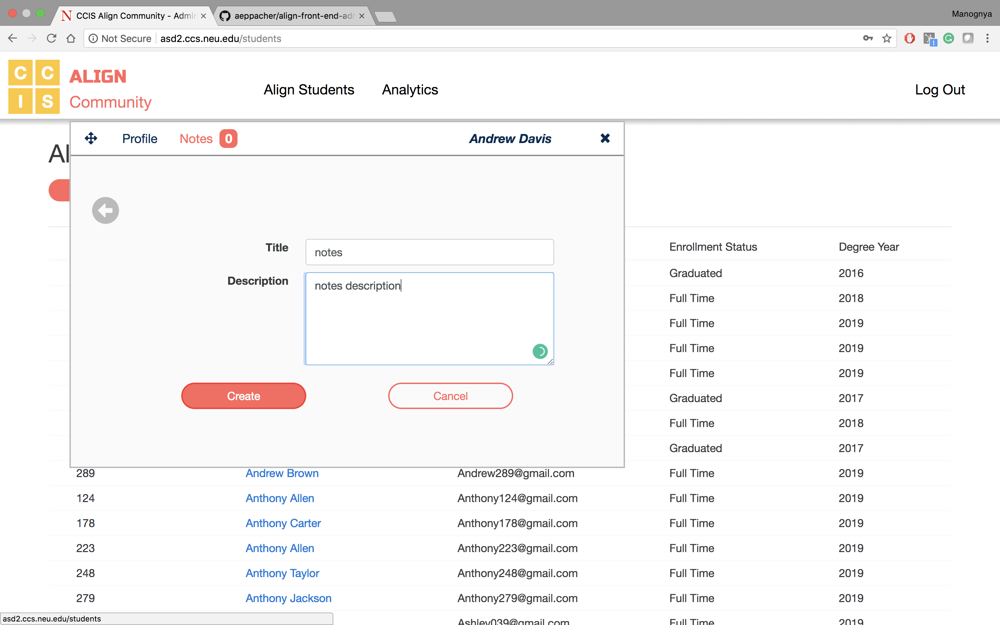

Analytics

"	Admin can select from the given queries to get the analytics

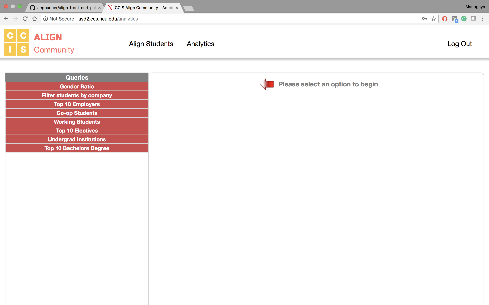

"	On selecting the fields, information is displayed in the form of charts and tables

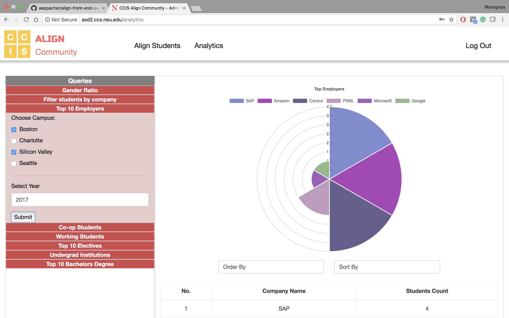

"	The information in the tables and charts can be re-ordered by selecting the  required field and the order(ascending/descending).

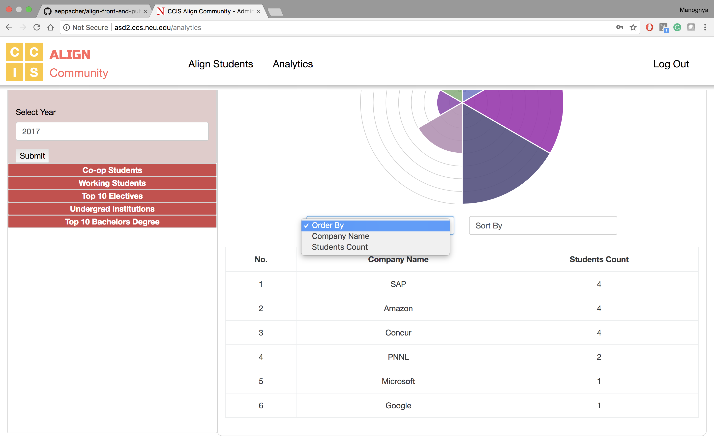

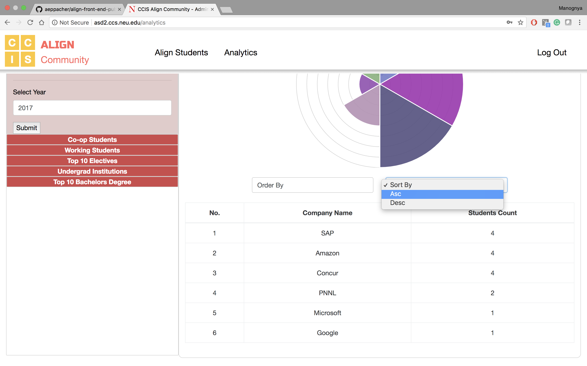
